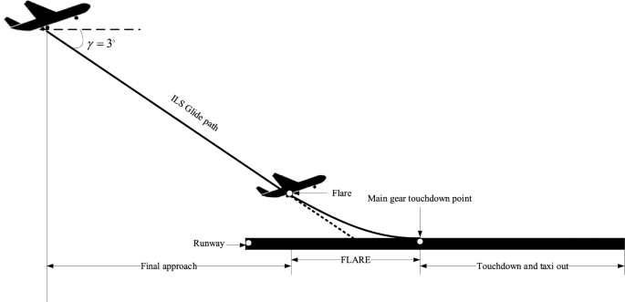
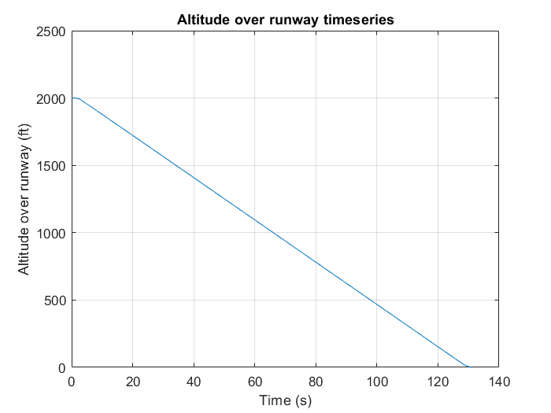
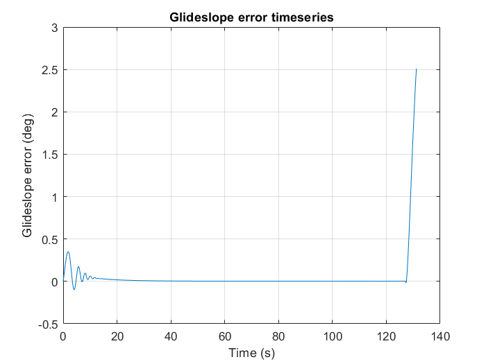
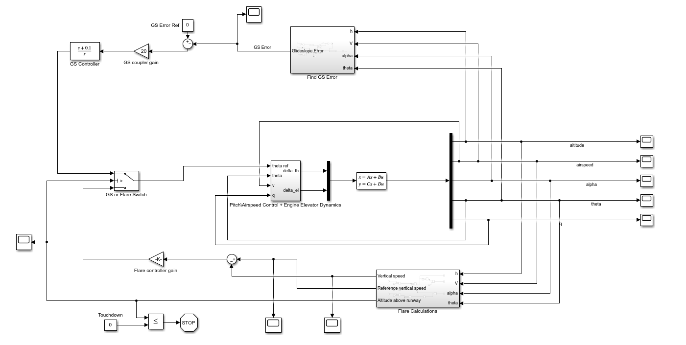
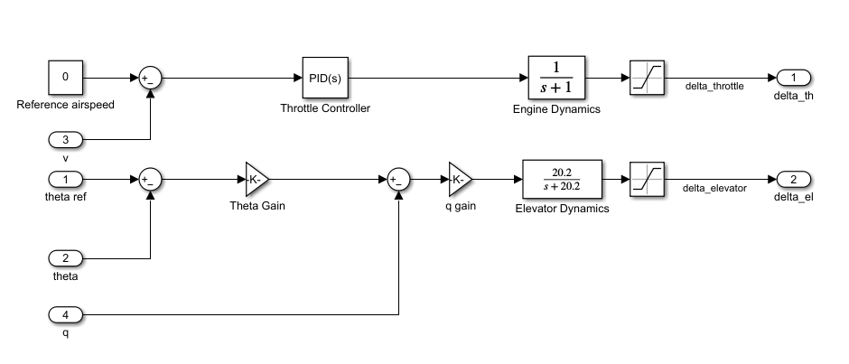
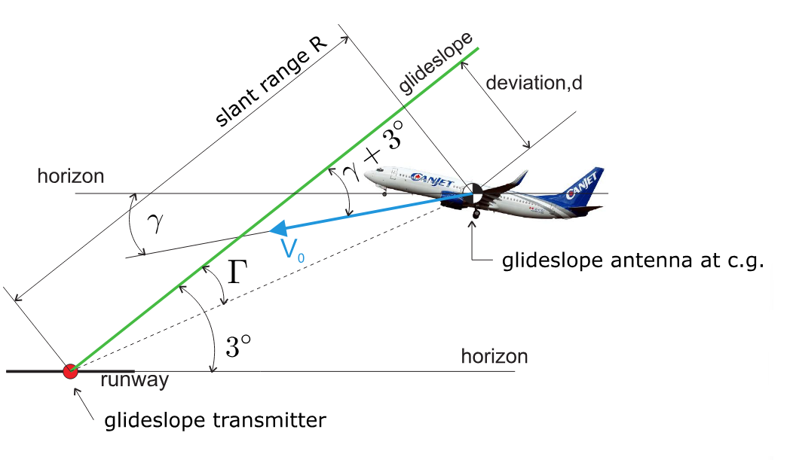
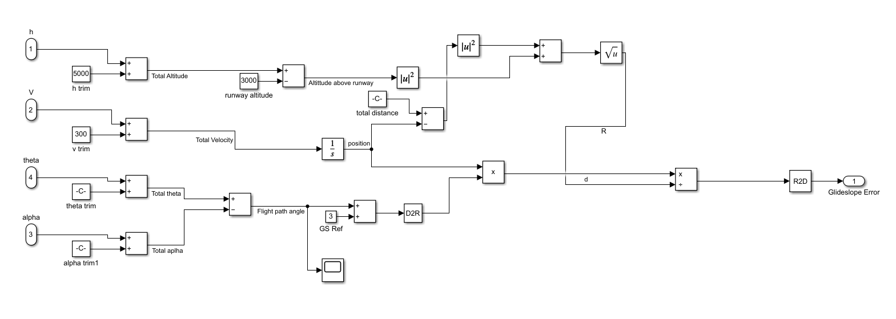
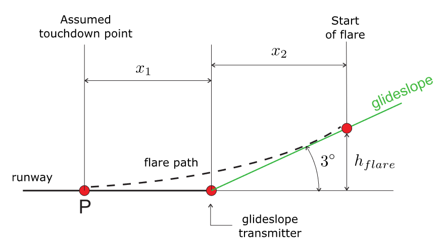
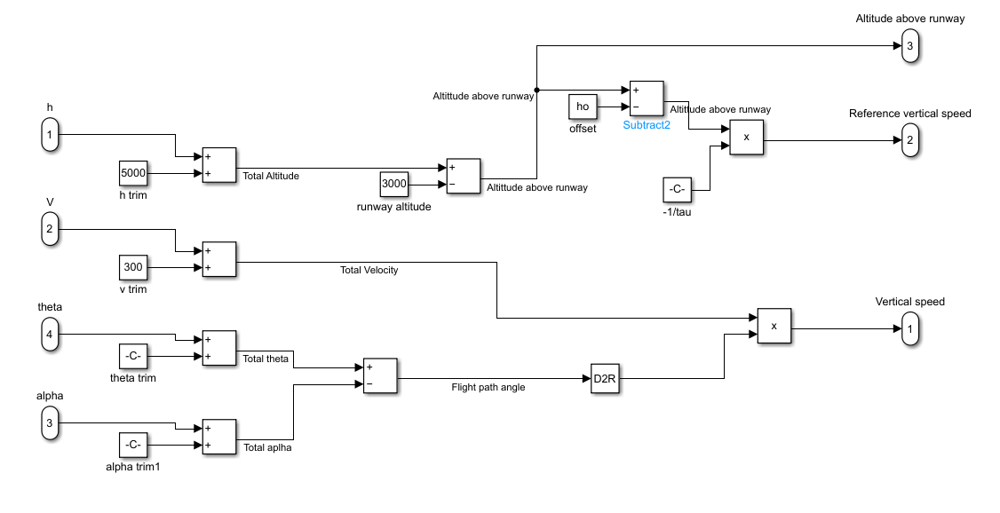

# Automatic Control System Design on F-16 Model

This project contains the control system design of an automated landing manoeuvre for an F-16 Simulink model. For the scope of this project, the focus is on the symmetric longitudinal control problem (so the localizer is considered).

## Problem Statement

The task is to design an automatic landing manoeuvre of an F-16. This will be done through a glideslope and flare controller subject to the following constraints:

- Initial height: 5000 ft
- Initial velocity: 300 ft/s
- Airfield altitude: 3000 ft
- Glideslope intercept = 3°
- Time to glideslope intercept: 10 s
- Vertical speed at touchdown ≤ 3 ft/s

The landing manoeuvre is best understood using the diagram shown below. Landing is divided into following a glide path with a prescribed angle of 3° and a flare manoeuvre where the aircraft changes its trajectory by pitching up slightly before touching down.

	

## Results

The successful landing manoeuvre starting from the initial conditions takes just over two minutes. The switch between the glideslope and flare controller happens roughly 5 seconds prior to landing. The descent and landing timeseries is shown below.

	

### Glideslope controller

The glideslope error throughout the whole manoeuvre is seen below. In the beginning it exhibits phugoid oscillatory behaviour, which eventually levels to zero error. A phugoid damper could be added to the F-16 model to prevent this. The shooting up at the end is caused by the aircraft switching to the flare controller.

	

### Flare Controller

The vertical speed timeseries is shown below. A clear change occurs when swapping from the glideslope to the flare controller as the rate of descent decreases from roughly -16 to -3.6 ft/s at the end, slightly above target. However, it can be better to come down a bit harder, especially for short runways (such as an aircraft carrier) on which F-16s tend to land. 

	

## Methodology
The full controller logic that handles both glideslope tracking and the flare consists of four main blocks:

1. The aircraft state space model
2. The pitch, airspeed controllers and actuator dynamics
3. The glideslope error
4. The flare calculations

The full block diagram containing all controllers and logic is shown below. Note the presence of the switch which determines whether it's in the glideslope tracking phase or the flare phase. It uses the height above runway to determine if it's below the flare manoeuvre height to determine which signal to allow through. The stop condition is triggered when height above runway ≤ 0.

	

The PID values for the airspeed, pitch, glideslope and flare controller were tuned experimentally until the desired behaviour was obtained using the following logic:

- Proportional → reduces rise time
- Integral → reduces steady state error
- Derivative → improves transient response

#### Aircraft state space model

The state space model used was a longitudinally reduced version of the full F-16 Simulink model.

#### Pitch, airspeed and actuator dynamics

Pitch and airspeed controllers were implemented to ensure that the pitch references were followed and a constant velocity was held. Actuators were modelled with first order lag dynamics. The inner workings of the block are shown below.

	

#### Glideslope error

The glideslope error block contains the logic used to determine the deviation from the prescribed 3° glideslope. To understand the logic encoded in the block, a diagram depicting the problem is given below.

	

Here, the $\Gamma$ is the glideslope error. From the geometry of the problem (using small angle approximation).

$$\Gamma = \tan^{-1}(\frac{d}{R}) \approx \frac{d}{R} $$
The deviation $d$ is found via the flight path angle and the position $\frac{V_0}{s}$. The $\frac{1}{s}$ comes from an integrator block, which dynamically calculates the position of the aircraft as the simulation runs.

$$d = \frac{V_0}{s} \frac{\pi}{180} (\gamma + 3)$$

The glideslope error is fed to the glideslope controller to generate a reference pitch the aircraft should follow during the glideslope tracking phase of landing. The inner workings of the block is shown below.

	

#### Flare calculations

The flare calculation block contains the logic to determine the error from the prescribed 3 ft/s vertical speed for landing. It's best understood with the diagram given below.

	

The approach basically simplifies things by fixing $x_1$ to be 800 ft and calculating the height above the runway by modelling the flare path using an exponential decay function:

$$h = h_{flare} e^{-\frac{t}{\tau}} - h_o$$

Where $h_o$ is some offset to ensure the aircraft actually touches down, as exponential decay never actually reaches zero. The values for $T$ (time taken to touchdown), $x_2$, $h_o$ and $\tau$ can be calculated by enforcing boundary conditions on the height function and its derivative. 

$$h(0) = x_2 \tan(\frac{3\pi}{180})$$
$$h(T) = 0 \ \text{ft}$$
$$\dot h(0) = -V\sin(\frac{3\pi}{180}) $$
$$\dot h(T) = -3 \ \text{ft/s} $$

The vertical speed error is fed to the flare controller to generate a reference pitch the aircraft should follow during the flare manoeuvre phase of landing. The inner workings of the block is shown below.

	

